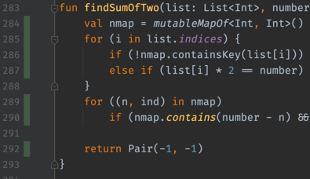
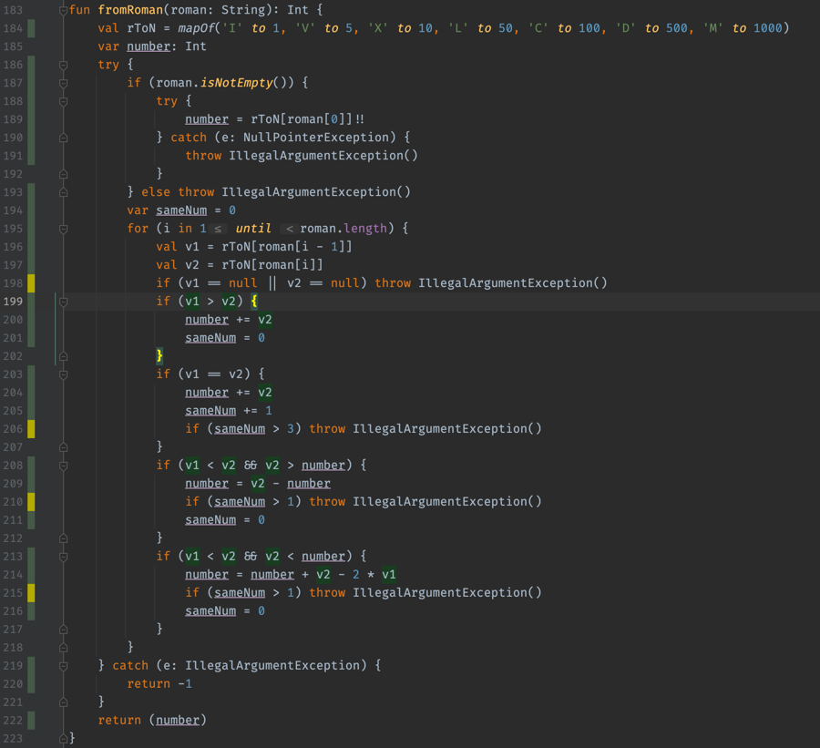
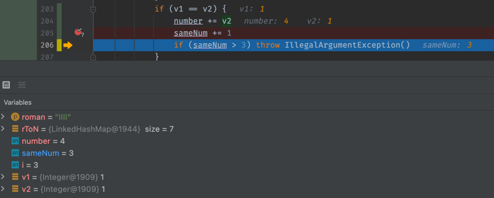
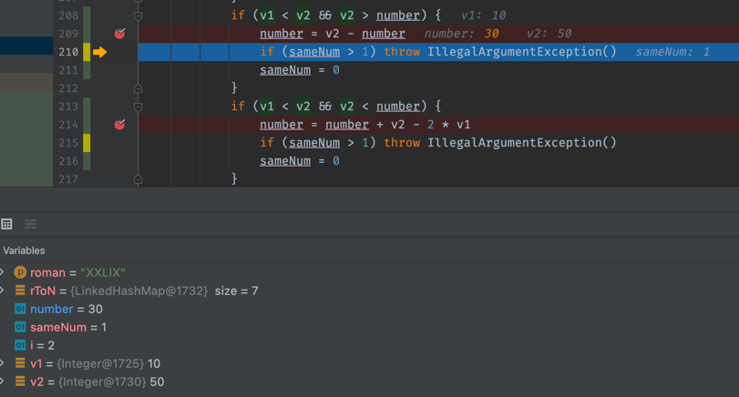
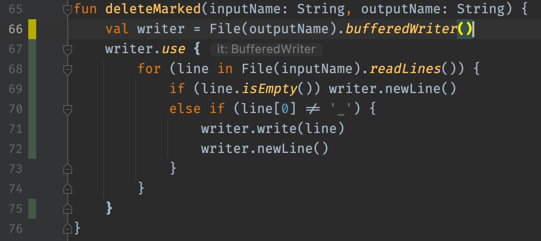

# Test Coverage Results

Test coverage evaluation is done with the built-in 
Intellij Runner with the `tracing` option.

The results below are identical to the JaCoCo coverage in our case,
but it's worth mentioning that using Java tools for Kotlin 
[has drawbacks](https://www.youtube.com/watch?v=jNu5LY9HIbw&t=215s). 
There is a thing named [Kover](https://github.com/Kotlin/kotlinx-kover),
but we're not using Gradle for this project, so I won't touch it for now. 

## `findSumOfTwo()`

All the lines are green which means all the branches have been visited.



## `fromRoman()`

Test coverage for this test shows there are some partially covered `if`s. 



### Line 198

The line indicates a case of strings with non-roman-number characters. 
This is true that such tests have not been implemented, and that's my fault.

Nevertheless, the condition `v1 == null` can never succeed, because the first
character is checked earlier (line 189), and all the next steps
check `v2 == null` with the guarantee that the previous step has
succeeded (the character wasn't `null`).

### Line 206

The line ensures there are no roman-numbers repeating more than 3 times a row.
My test contains such a case, and it resulted in a fault, which means this `if`
doesn't really work. Here is the check from my test:

```kotlin
// [FAULT FOUND]
// Ensure there are no things like IIII
REPEATABLE.forEach {
    assertResult("$it".repeat(4), -1)
}
```

It verifies that `IIII` is -1, and not 4, and fails. 
Using the debugger, we can see:



The condition must have probably been `sameNum >= 3`.

### Lines 210 and 215

These lines should check cases like `IIV`, but it's the same typo here:



Also, I should've made a test for it: something like `XXLIX` which must be -1, but now it's 39.

## `deleteMarked()`

All the lines are green except for the first one.



The first line is a call to the `inline`-function, 
and if we go deep through the inner `inline`-functions,
we'll find a branch:

```kotlin
/** Returns a buffered writer wrapping this Writer, or this Writer itself if it is already buffered. */
@kotlin.internal.InlineOnly
public inline fun Writer.buffered(bufferSize: Int = DEFAULT_BUFFER_SIZE): BufferedWriter =
    if (this is BufferedWriter) this else BufferedWriter(this, bufferSize)
```

Seems, this `if` is always executed the same way throughout 
all the test runs, and one of its branches is never visited,
which is ok, since we only change the explicit input parameters,
and not the "environment".
